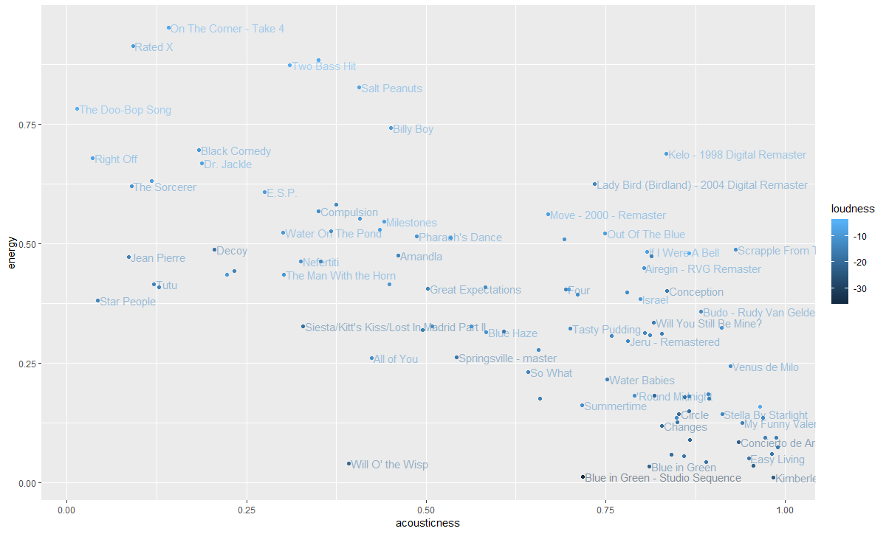

Balance in the music of Miles Davis

Jazz musician Miles Davis has made music in a variety of styles, in which acoustic instruments as well as electric instruments play a big role. the main topic of my research will be how the acousticness stands in relation to other variables, like energy, in the music. For this I will be using the 'This is Miles Davis' list from Spotify because this represents the oeuvre of Miles Davis well. Beside of the overall list of Miles Davis' hits I will look closer to the details of a couple of leading albums (Relaxin' with the Miles Davis Quintet, Kind of Blue, Nefertiti, Bitches Brew, You're Under Arrest and Doo-bop) and compare the means of these albums to get a good view of how the music of Davis changes through the years (as he becomes Electric Miles). 

I have found out that if you compare the album Kind of Blue (1959) and Doo-Bop (1992) that while the mean of the energy on Kind of Blue is 0.165 the mean of the energy on Doo-Bop is 0.678. The means of the acousticness respectively are 0.715 and 0.00697.
Below you can see a graph in which the acousticness is set against the energy.

